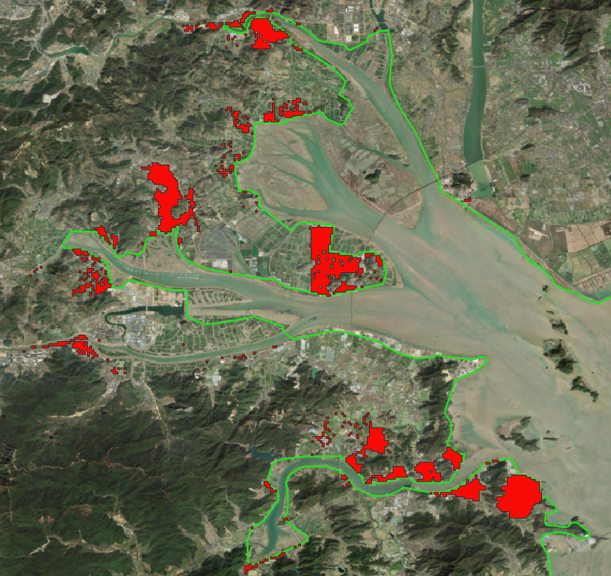
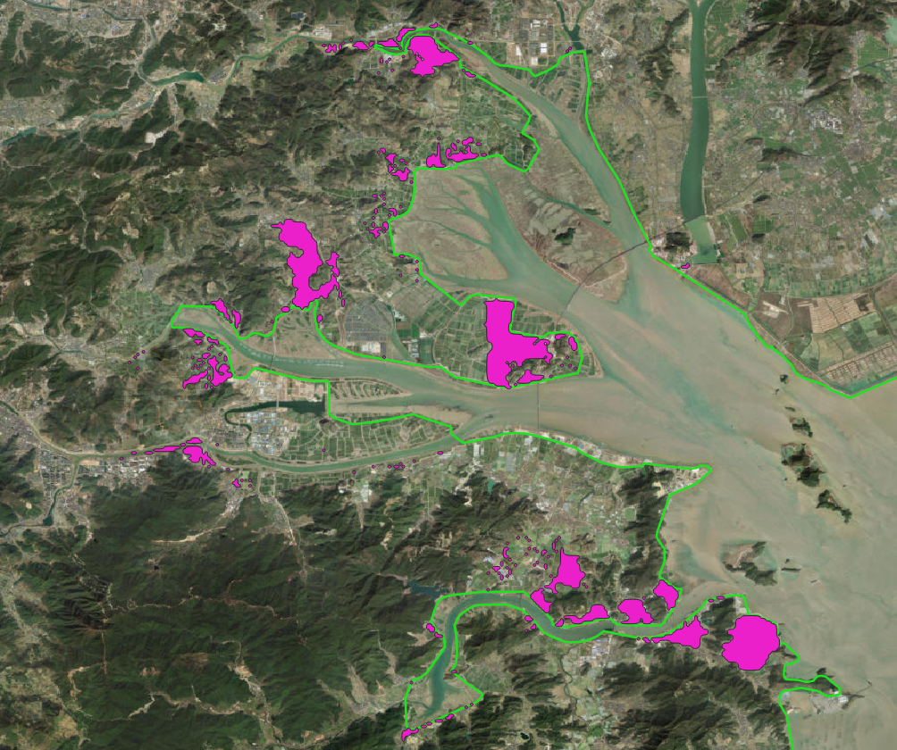

### 后台数据处理说明文档

> 2025-06-17

#### 08- 对淹没范围进行插值使轮廓圆滑

> 08-将淹没范围进行圆滑处理.py

效果如下:

淹没大于2m的范围原始数据:

插值后的淹没范围:

以下是 Chaikin 插值算法的公式：

##### Chaikin 插值算法的步骤

1. **输入控制点**：首先，提供一组控制点
   $$
   ( P_0, P_1, \ldots, P_n )
   $$
   

2. **计算插值点**：对于每对相邻的控制点
   $$
   ( P_i ) 和 ( P_{i+1} )
   $$
   ，计算两个新的插值点：
   
   - $$
     ( Q_i = \frac{3}{4} P_i + \frac{1}{4} P_{i+1} )
     $$
   
     $$
     ( R_i = \frac{1}{4} P_i + \frac{3}{4} P_{i+1} )
     $$
   
     
   
3. **生成新的控制点集**：将所有的插值点 \( Q_i \) 和 \( R_i \) 组合成新的控制点集。

4. **重复迭代**：对新的控制点集重复上述步骤，直到达到所需的平滑程度。

##### 数学公式

对于给定的控制点
$$
( P_i )
$$
 和
$$
( P_{i+1} )
$$
，Chaikin 插值的公式为：

$$
[
Q_i = \frac{3}{4} P_i + \frac{1}{4} P_{i+1}
]
$$

$$
[
R_i = \frac{1}{4} P_i + \frac{3}{4} P_{i+1}
]
$$

##### 结果

通过迭代应用上述公式，Chaikin 插值算法能够生成一条平滑的曲线。
